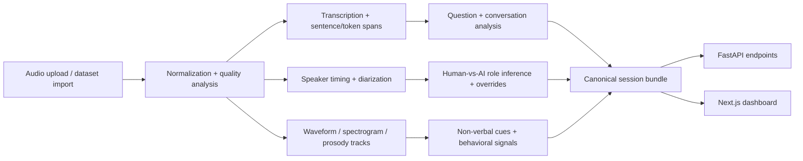

# Spectrum

## Voice analytics that goes beyond transcripts

Spectrum turns recorded conversations into structured voice intelligence: transcript, timing, speaker balance, pauses, overlaps, prosody, non-verbal cues, and evidence-backed behavioral signals.

Built as a hackathon-speed prototype, Spectrum explores a simple thesis: text-only conversation analytics miss the most human parts of a call.

## The Problem

Most voice products flatten audio into a transcript.

That loses the signals that usually matter most:

- hesitation before an answer
- interruptions and talk balance
- pacing, energy, and response latency
- quality issues that distort interpretation
- human-vs-AI role context in mixed conversations

For support, research, coaching, and voice-agent teams, that means weaker QA, weaker personalization, and weaker insight into how a conversation actually unfolded.

## Why Spectrum

Most tools stop at one layer:

| Tool category | What it gives you | What is still missing |
| --- | --- | --- |
| Speech-to-text | Words | No pacing, turn-taking, or behavioral context |
| Emotion API | Labels | Weak evidence trail and easy overclaiming |
| Analytics dashboard | Charts | Often detached from the raw conversation |
| Spectrum | One evidence-linked session bundle plus API and UI | A fuller foundation for voice intelligence workflows |

Spectrum is closer to "Google Analytics for voice" than a one-off transcript or emotion wrapper.

## What Spectrum Does

Given an uploaded audio file or imported demo session, Spectrum:

- normalizes audio and stores a canonical session bundle
- generates transcript, sentence spans, token spans, and speaker timing
- extracts waveform, spectrogram, prosody tracks, and non-verbal cues
- computes evidence-backed behavioral and affective proxy signals with explainability masks
- exposes the result through a FastAPI backend and a Next.js dashboard

## Demo Flow

1. Create a session and upload audio.
2. Run processing synchronously or asynchronously.
3. Review the output in the dashboard:
   - overview and compare surfaces
   - a detailed session workspace with transcript, waveform, spectrogram, cues, and signals
   - role-aware controls for human-vs-AI conversation review
4. Pull the same data back from the API as structured JSON.

> Spectrum ships today as an uploaded or imported recording analysis workflow. Real-time streaming is a future direction, not a current product claim.

## How It Works



## What Ships Today

| Surface | Current capability |
| --- | --- |
| Upload pipeline | Create sessions, upload audio, and process sync or async |
| Analysis bundle | Transcript, turns, events, questions, signals, roles, waveform, spectrogram, and prosody |
| Dashboard | Browse sessions, compare runs, and inspect a detailed session workspace |
| API | Fetch bundle, transcript, profile, roles, diarization, cues, prosody, waveform, spectrogram, questions, and signals |
| Demo data | Import a demo pack or curated dataset samples for instant exploration |

## Hard Parts We Tackled

- turning raw audio into a stable, reusable session bundle instead of one-off outputs
- keeping transcript, speaker timing, waveform, spectrogram, cues, and signals aligned in one review surface
- confidence-gating behavioral interpretation when low SNR or VAD instability should downweight claims
- supporting both uploaded audio and saved demo sessions through the same API and dashboard workflow

## Example Output

This is a shortened excerpt from a real saved `bundle.json` in the repo:

```json
{
  "session": {
    "session_id": "97c51a06-a626-4361-9244-9fb4f832ad57",
    "analysis_mode": "voice_profile",
    "source_type": "direct_audio_file",
    "duration_sec": 1.0,
    "status": "completed"
  },
  "quality": {
    "avg_snr_db": 7.655,
    "noise_ratio": 0.259,
    "is_usable": true,
    "warning_flags": [
      "silero_vad_fallback",
      "shorter_than_voice_profile_target",
      "low_snr"
    ]
  },
  "signals": [
    {
      "key": "hesitation",
      "score": 0,
      "confidence": 0.28,
      "summary": "Pause and filler burden averaged 0/100 across question moments."
    },
    {
      "key": "confidence_like_behavior",
      "score": 68,
      "confidence": 0.28,
      "summary": "Direct answers and lower uncertainty markers lift this behavioral confidence proxy."
    }
  ]
}
```

## Use Cases

- customer support QA and escalation review
- user research and interview analysis
- coaching and call feedback
- voice-agent debugging and human-vs-AI interaction analysis
- any workflow where how it was said matters as much as what was said

## Tech Stack

| Layer | Stack |
| --- | --- |
| API | FastAPI, Pydantic |
| Dashboard | Next.js, React |
| Audio processing | FFmpeg, librosa, NumPy |
| Analysis pipeline | Python pipeline with canonical models and persisted run artifacts |
| Optional AI provider | OpenAI-backed upload analysis and role inference |
| Local ASR fallback | `faster-whisper` in supported setups |
| Verification | pytest |

## Repo Layout

```text
spectrum/
  packages/
    api/        FastAPI service and session endpoints
    core/       canonical models, dataset helpers, registry metadata
    dashboard/  Next.js UI for overview, compare, and session review
    pipeline/   normalization, analysis, importers, and run persistence
  scripts/      local helpers
  tests/        API and pipeline coverage
```

## Local Development

Create the Python environment and install the backend dependencies:

```bash
uv venv --python 3.11
source .venv/bin/activate
uv pip install -e ".[server,audio,demo,dev]"
```

Install dashboard dependencies:

```bash
pnpm install
```

Run the API:

```bash
pnpm api:dev
```

Run the dashboard:

```bash
pnpm dashboard:dev
```

## API Path

The main workflow is:

- `POST /api/v1/sessions`
- `POST /api/v1/sessions/{job_id}/upload`
- `POST /api/v1/sessions/{job_id}/process` or `POST /api/v1/sessions/{job_id}/process-async`
- `GET /api/v1/sessions/{job_id}/bundle`

Additional endpoints expose transcript, roles, profile, diarization, non-verbal cues, prosody, waveform, spectrogram, questions, signals, compare data, and adapter registry metadata.

## Vision

Text-only AI is incomplete.

The next wave of voice intelligence systems should preserve evidence, uncertainty, and conversation structure instead of flattening people into transcripts or overconfident emotion labels.

Spectrum is a step in that direction:

- post-call voice intelligence today
- stronger calibration and adapter depth next
- better developer-facing SDK ergonomics after that
- streaming and broader conversation intelligence later

## Repo Notes

This repo is intentionally code-first.

These stay local and are not intended for source control:

- `data/` raw and cached dataset payloads
- `runs/` generated analysis outputs
- `.env` and any local secrets
- generated build output such as `.next/`

## Contributing

Contributions are welcome.

If you want to contribute:

1. read [CONTRIBUTING.md](./CONTRIBUTING.md)
2. open an issue or discussion for larger changes
3. keep data, runs, secrets, and local media out of git
4. prefer small, reviewable pull requests with tests where practical

For agent-oriented repo guidance, see [AGENTS.md](./AGENTS.md).

## License

[MIT](./LICENSE)
