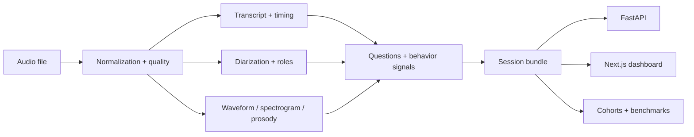

# Spectrum

## Comprehensive conversation reports for human-AI voice calls

Spectrum turns one human-AI voice call into one **conversation report**: outcome, breakdowns, likely causes, confidence, evidence, and next checks. Under the report, Spectrum still writes a portable **session bundle** with transcript, timing, speakers, readiness, waveform, spectrogram, prosody, cues, profile coverage, and evidence-backed behavioral signals.

The product is built around one primary loop:

1. bootstrap the local stack
2. analyze one recording
3. open one conversation report
4. inspect every claim against transcript/audio evidence

Everything else in the repo builds on top of that report-backed bundle model.

## 3-minute quickstart

```bash
make bootstrap
make demo
make dev
spectrum analyze examples/sample.wav --open
```

What to expect:

- the API starts on `http://127.0.0.1:8000`
- the dashboard starts on `http://127.0.0.1:3000`
- `spectrum analyze` writes a new run under `runs/<session_id>/`
- `--open` takes you straight to the report-first session page

If you want to exercise the API directly, see [examples/curl.md](./examples/curl.md) or run [examples/quickstart.py](./examples/quickstart.py).

## Sample conversation reports

To show the product direction without running the full app, open [examples/conversation_reports/index.html](./examples/conversation_reports/index.html).

The sample pack includes synthetic reports for customer support, appointment scheduling, outbound sales qualification, and billing/payment follow-up, plus structured sample data in [examples/conversation_reports/sample_reports.json](./examples/conversation_reports/sample_reports.json).

## What Spectrum is

Spectrum is an open-source voice analytics foundation for teams debugging recorded human↔AI conversations.

It is designed for workflows where transcripts alone are not enough and every call needs a useful diagnostic report:

- voice-agent debugging
- product ops for conversation systems
- support QA and user research as adjacent report modes
- coaching and call review as later report templates

## The conversation report

Every analysis ends in one diagnostic report that can be:

- inspected in the dashboard
- fetched through the API
- traced back to transcript/audio evidence
- compared across agent versions
- aggregated into cohorts later

The session bundle remains the infrastructure boundary underneath the report. It can still be:

- reused by developers
- compared across sessions
- aggregated into cohorts
- evaluated against benchmark tasks

The report is the primary product object; the bundle is the portable infrastructure object.

## Analyze one file

### CLI

```bash
spectrum analyze examples/sample.wav --open
```

### API

```bash
curl -s -X POST http://127.0.0.1:8000/api/v1/sessions \
  -H 'content-type: application/json' \
  -d '{"analysis_mode":"full","metadata":{"title":"My first session"}}'
```

Then:

1. upload the file
2. process the session
3. fetch `/api/v1/sessions/<job_id>/bundle`
4. open `/sessions/<job_id>` in the dashboard

## Open the dashboard

The dashboard is API-first and centered on the conversation-report workflow:

- home page: analyze one file, recent sessions, quickstart guidance
- session page: report diagnosis, findings, trust limits, transcript, timing, cues, and evidence
- compare page: side-by-side run inspection

Advanced surfaces remain available, but they are secondary:

- cohort analytics
- benchmark coverage
- dataset health and import status

## Architecture in one diagram



## What ships today

| Surface | Status | What it gives you |
| --- | --- | --- |
| Single-file analysis | Ready | Analyze one local recording into a persisted session bundle |
| Session workspace | Ready | Transcript, waveform, spectrogram, roles, cues, signals, and caveats |
| API | Ready | Bundle, transcript, profile, roles, diarization, cues, prosody, waveform, and spectrogram endpoints |
| Compare view | Ready | Session bundle comparison for quality and signals |
| Cohort analytics | Available | Aggregate KPIs, trends, distributions, and filtered session rows |
| Benchmarks | Available | Registry and result snapshots across supported datasets |
| Dataset importers | Available | Demo pack and local dataset sample import workflows |

## Developer workflow

### Bootstrap

```bash
make bootstrap
```

This creates a local Python environment, installs the Python package with server/audio/demo/provider extras, and installs dashboard dependencies.

### Demo data

```bash
make demo
```

This imports the bundled demo sessions so the dashboard has immediate content even before you analyze your own audio.

### Local dev

```bash
make dev
```

This runs:

- FastAPI on `127.0.0.1:8000`
- Next.js on `127.0.0.1:3000`

## Public interfaces

### CLI

- `spectrum analyze <file> --open`
- `spectrum demo`
- `spectrum serve`

### Core API

- `POST /api/v1/sessions`
- `POST /api/v1/sessions/{job_id}/upload`
- `POST /api/v1/sessions/{job_id}/process`
- `GET /api/v1/sessions/{job_id}/bundle`

### Session detail API

- transcript
- profile
- roles
- diarization
- non-verbal cues
- prosody
- waveform
- spectrogram

### Advanced API

- cohorts
- benchmarks
- datasets
- adapter and metric registry metadata

## Repo layout

```text
spectrum/
  packages/
    api/        FastAPI service and CLI entrypoints
    core/       canonical models and registry metadata
    dashboard/  Next.js dashboard
    pipeline/   analysis pipeline, providers, importers, persistence
  examples/     sample audio and quickstart scripts
  scripts/      local developer helpers
  tests/        API and pipeline tests
```

## Capability framing

| Area | Current posture |
| --- | --- |
| Session bundle contract | First-class product boundary |
| Uploaded audio analysis | OSS-first default with readiness tiers |
| Human↔AI review | First-class in the session workspace |
| Evidence-backed signals | Visible in the UI with evidence classes |
| Cohorts and benchmarks | Shipped, but secondary to the session loop |

## Repo notes

These stay local and are not intended for source control:

- `.env`
- generated build output
- local runs and caches that are not explicitly tracked
- personal datasets or secrets

## Contributing

Contributions are welcome.

1. follow the quickstart
2. keep the single-session workflow easy to understand
3. keep the backend as the source of truth for persisted bundle reads
4. add tests when you change pipeline or API behavior

For contributor workflow details, see [AGENTS.md](./AGENTS.md).

## License

[MIT](./LICENSE)
